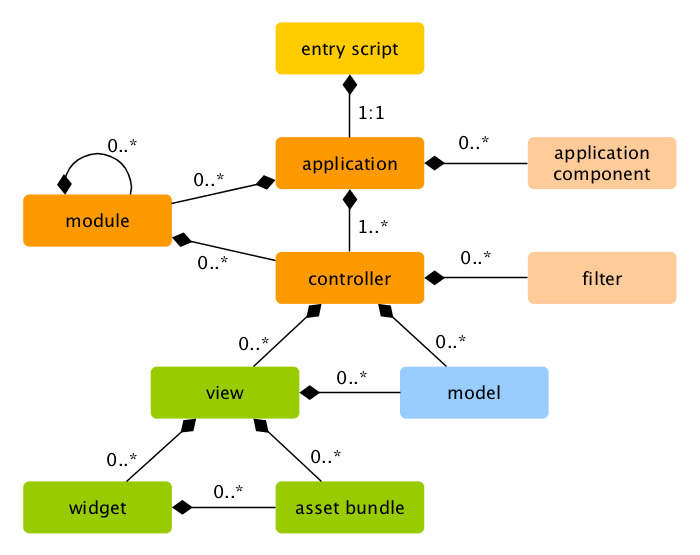

title: YII2 Framework
author:
  name: Cherif BOUCHELAGHEM
  twitter: cherif_b
  github: cherifGsoul
  url: http://cherifbouchelaghem.com
output: index.html
controls: false
theme: theme

--
# Yii/Yii2 FRAMWORK
## Framework pour les COMMUNISTES :D

> Yii is a high performance, component-based PHP framework for rapidly
> developing modern Web applications. The name Yii (pronounced Yee or [ji
> :] ) means “simple and evolutionary” in Chinese. It can also be thought of
> as an acronym for <b>Yes It Is!</b>

--
## Versions
Actuellements existe 2 générations du framework
* Yii 1.1.X (PHP>=5.1)
* Yii 2.X.X (PHP>=5.4)

--
### Yii 1.1.X (PHP>=5.1)
La version qui existe depuis 01 Janvier 2008, fin de support Décembre 2016

--
### Yii 2.X.X (PHP>=5.4)
La version que vous devez choisir
* Prête pour PHP7
* Marche sur HHVM
--
### Caractérstiques
 * Comme la plupart des frameworks, Yii implémente le pattern architectural MVC
 * Installation ou création de projet via Composer (PSR4 autoloading)
 * Migration de base de données automatisée
 * Active Record et Query builder (Relationel et noSQL)
 * HTTP filters
 * développement des API RESTFul
 * RBAC (Role Based Access Control)
 * Caching
 * ...
--

### Il est bien pour:
Son architecture orientée composant lui permet d'être le choix pour toutes applications web de grande échelle
* Portail
* Application Entreprise
* CMS (Content management systems)
* Projets e-commerce
* Web Services Restful
* ...

--
## Applications

* Web Application
  * Basic
  * Advanced
--
### Web Application
##

--
### Web Application
#### Entry script
```php
// comment out the following two lines when deployed to production
defined('YII_DEBUG') or define('YII_DEBUG', true);
defined('YII_ENV') or define('YII_ENV', 'dev');

require(__DIR__ . '/../vendor/autoload.php');
require(__DIR__ . '/../vendor/yiisoft/yii2/Yii.php');

$config = require(__DIR__ . '/../config/web.php');

(new yii\web\Application($config))->run();
```
--
## Les basiques
* Object (Objet)
* Component (Composant)
* Models (Sans connexion à la base de données)
* Active Record (Models connectés à une base de données)
* Controllers
* Views
* Modules
* Base de données

--
### Object (Objet)

Pratiquement la classe de base pour touts les composants du framework, la classe Object facilite l'accée au proporiéte d'objet
```php
class TodoList extends \yii\base\Object
{
    private $name;
    private $tasks;

    public function getName() { return $this->name; }
    public function setName($name) { $this->name=$name; }
    public function getTasks() { return $this->tasks; }
    public function setTasks($tasks) { $this->tasks = $tasks; }
    public function addTask ($task) { $this->tasks[] = $task; }
}
$todoList = new TodoList;
$todoList->name = 'My Todolist'; // équivalent a $todoList->setName('My Todolist');
echo $todoList->name; // équivalent a echo $todoList->getName();
```
--
### Application Components (Composants)
Peuvent être configurés dans la propriéte \Yii\base\Application::$components
```php
...
'components' => [
    'request' => [
        'cookieValidationKey' => 'ovAGe8c4pyo55P9Nq_A9nQ6sWvmVpzN_',
    ],
    'cache' => ['class' => 'yii\caching\FileCache'],
    'user' => [
        'identityClass' => 'app\models\User',
        'enableAutoLogin' => true,
    ],
    'errorHandler' => [ 'errorAction' => 'site/error'],
    'mailer' => [
        'class' => 'yii\swiftmailer\Mailer',
        'useFileTransport' => true,
    ]
```
```php
//les composant peuvent être accédés comme suit:
\Yii::$app->cache
// pour db
\Yii::$app->db
```
--
### Application Components (Composants)
Les composants disponble dans le framework:
* assetManager: Pour la gestion des assets (CSS,JS,IMG ... etc)
* db: Connexion à une base de données plus l'execution des requêtes SQL
* errorHandler: Gestionnaire d'erreurs
* formatter: Formatage des données comme la date, le nombre de chiffre aprés la virgule ...
* i18n: Traducation de texte et chaine de caractéres
* log: Gestion de log
* mailer: Envoie des emails avec swiftmailer
* request: gestion des requêtes HTTP
* response: gestion des reponses HTTP
* session: gestion des sessions
* urlManager: gestion des URLs et reécriture
* user: gestion d'authentification
* view: gestion du rendu HTML
--
### Models (Sans connexion à la base de données)
#### Création de classe
Le "M" dans MVC, sont des objets qui représentent les données et les régles de gestion de la logique métiers
Les Models dans Yii peuvent être créés en utilisant la class \yii\base\Model

```php
class TodoList extends yii\base\Model
{
  public $name;
  public $status;
  public $tasks;

  public function rules()
  {
    return [ ['name,status','required'], ['status','integer'] ];
  }
  public function attributeLabels()
  {
    return [
      'name'=>'Nom',
      'status'=>'Status'
    ];
  }
}
```
--
### Models (Sans connexion à la base de données)
#### Utilisation de la classe
```php
// dans une application réelle les données sont passées via Controller
$todolist = new TodoList;
$data = ['name'=>'Holiday tasks', 'status'=>0];
$todolist->attributes = $data;
if($todolist->validate()) {
  ///save the model
}
```
Récupérer les données du web (Formulaire)
```php
// dans une application réelle les données sont passées via Controller
$todolist = new TodoList;
$model->attributes = \Yii::$app->request->post('TodoList');
if($todolist->validate()) {
  ///save the model
}
```
--
### Active Record (Models connectés à une base de données)
L'Active Record (AR) est un pattern qui permet l'accées au données enregistrés dans une base de données via une interface de programmation orientée objet ou la classe est associée à une table et une instance de  cette classe correspond a une ligne dans cette table
```php
class TodoList extends \yii\db\ActiveRecord
{

  public function rules()
  {
    return [ ['name,status','required'], ['status','integer'] ];
  }
  public function attributeLabels()
  {
    return [
      'name'=>'Nom',
      'status'=>'Status'
    ];
  }
}
```
--
### Active Record (Models connectés à une base de données)
#### Utilisation
```php
// dans une application réelle les données sont passées via Controller
$todolist = new TodoList;
$data = ['name'=>'Holiday tasks', 'status'=>0];
$todolist->attributes = $data;
if($todolist->save()) {
  //do something
}
```
Récupérer les données du web (Formulaire)
```php
// dans une application réelle les données sont passées via Controller
$todolist = new TodoList;
$model->attributes = \Yii::$app->request->post('TodoList');
if($todolist->save()) {
  //do something
}
```
--
### Active Record (Models connectés à une base de données)
#### Récupérer les données
```php
//tout les enregistrement dans une table
$lists = TodoList::find()->where(['status'=>TodoList::STATUS_INCOMPLETE])
        ->orderBy('id')->all();
// un seul enregistrement
$list = TodoList::find()->where(['id'=>654])->one();
// calcule le nombre d'enregistrements
$count = TodoList::find()->where(['status'=>TodoList::STATUS_COMPLETE])->count();
// indexés par IDs
$lists = TodoList::find()->indexBy('id')->all();
```
Racourcis:
```php
//tout les enregistrement dans une table
$lists = TodoList::findAll(['status'=>TodoList::STATUS_INCOMPLETE]);

// un seul enregistrement
$list = TodoList::findOne(654);
```

--
### Active Record (Models connectés à une base de données)
#### Relations
```php
class TodoList extends \yii\db\ActiveRecord
{
  //...
  public function getTasks()
  {
    return $this->hasMany(Task::className(), ['todolist_id' => 'id']);
  }
  public function getOwner()
  {
    return $this->hasOne(User::className(), ['id' => 'user_id']);
  }
}

//lazy loading
$list = TodoList::findOne(125);
foreach ($list->tasks as $task) { echo $task->name; }
//eager loading
$list = TodoList::find()->with('tasks')->where(['id'=>125]);
foreach ($list->tasks as $task) { echo $task->name; }
```

--
### Controllers
Le "C" dans MVC, sont des classes filles de la classe yii\base\Controller, ont la responsabilité de résoudre la requête venue de l'utilsateur et envoyer la résponse.

```php

class TodoListController extends Controller
{
  public function actionView($id)
  {
    $model = TodoList::findOne($id);
    if ($model === null) {
      throw new NotFoundHttpException;
    }
    return $this->render('view', [
      'model' => $model,
    ]);
  }
  public function actionCreate()
  {
    $model = new TodoList;
    if ($model->load(Yii::$app->request->post()) && $model->save()) {
      return $this->redirect(['view', 'id' => $model->id]);
    } else {
      return $this->render('create', [
        'model' => $model,
      ]);
    }
  }
}
```
--
### Views (Vues)
Le "V" dans MVC, sont des codes PHP reponsable de la présentation des données à l'utilisateur final:
```php
use yii\helpers\Html;
use yii\bootstrap\ActiveForm;

$this->title = 'Login';
$this->params['breadcrumbs'][] = $this->title;
?>
<div class="site-login">
    <h1><?= Html::encode($this->title) ?></h1>
    <?php $form = ActiveForm::begin(); ?>
        <?= $form->field($model, 'username') ?>
        <?= $form->field($model, 'password')->passwordInput() ?>
        <?= Html::submitButton('Login') ?>

    <?php ActiveForm::end(); ?>
</div>
```
--
### Base de données
#### Configuration de connexion à une base de données

* Basé sur PDO
* Support multiple de base de données (MySQL, PGSQL, MSSQLSRVER,ORACLE ..)
* Caching
* Plusieurs connexion dans une seule application
* SQL brute, Query Builder et systéme de migration

```php
//...
'components' => [
  // ...
  'db' => [
    'class' => 'yii\db\Connection',
    'dsn' => 'mysql:host=localhost;dbname=example',
    'username' => 'root',
    'password' => ',
    'charset' => 'utf8',
  ],
//...
],
//...
```
--
### Base de données
#### Exécution des requéte
##### Les requêtes de selection
```php
/// Listes des todos
$todolists = \Yii::$app->db->createCommand('SELECT * FROM todolist')->queryAll();
/// retourne false si pas de résultat
$todolist = \Yii::$app->db->createCommand('SELECT * FROM todolist WHERE id=1')->queryOne();
/// retourne une seule colonne sinon un array vide
$names = \Yii::$app->db->createCommand('SELECT name FROM todolist')->queryColumn();
/// retourne une valaur scalaire, false si aucun résultat
$count = \Yii::$app->db->createCommand('SELECT COUNT(*) FROM todolist')->queryScalar();
```

--
### Base de données
#### Exécution des requéte
##### Les requêtes d'exécution
```php
\Yii::$app->db->createCommand('UPDATE todolist SET status=1 WHERE id=1')->execute();
```
Syntaxe alternative
```php
//update
\Yii::$app->db->createCommand()->update('todolist',['status'=>1], 'id=1')->execute();
//insertion
\Yii::$app->db->createCommand()->insert('todolist',['name'=>'Tomorrow Tasks'])->execute();
//Delete
\Yii::$app->db->createCommand()->delete('todolist','status=1')->execute();
```
--
### Base de données
#### Query Builder
Permet de construire les requêtes SQL avec la POO
```php
use yii\db\Query;
$todolists = (new \yii\db\Query())
    ->select([('id', 'name'])
    ->from('todolist')
    ->where(['status' => 0])
    ->limit(10)
    ->all();
```
Vous trouvez plus de détails sur Yii query builder dans la documentation officielle

--
## Modules
Sont des minis applications qui peuvent avoir la même structure qu'une application ordinaire sauf que ils peuvent pas vivre en dehors d'une application Yii.
##

--
## Filters
Filters sont des classes qui s'excutent avant et après une action d'un controller, par exemple access control filter peut être invoquer pour vérifier qu'un utilisateur a le prévilége avant d'éxecuter l'action, un filter doit être rattacher a un controller comme suit:

```php
public function behaviors()
{
  return [
    [
      'class' => 'yii\filters\HttpCache',
      'only' => ['index', 'view'],
      'lastModified' => function ($action, $params) {
        $q = new \yii\db\Query();
        return $q->from('user')->max('updated_at');
      }
    ]
  ];
}
```
--
## Widgets
Sont des blocks reétulisable dans la vue (view) pour construire des élements UI complexes et confifigurable avec la POO:
```php
<?php
  use yii\jui\DatePicker;
?>
<?= DatePicker::widget([
  'model' => $model,
  'attribute' => 'from_date',
  'language' => 'fr',
  'clientOptions' => [
  'dateFormat' => 'yy-mm-dd',
],
]);
 ?>
```
--
## Outils de développement
* Gii (échaffaudage)
* Debug
* Codeception

--
### Gii (échaffaudage)
##
--
### Debug
##

--
### Codeception
Est le framework de test dans Yii2, c'est un framework modulaire basé sur PHPUnit entre autres, il couvre les 3 types de test
#### Unit tests
Pour assurer le test des composant en isolation
#### Intergration tests
Pour assurer que les différent composants travail bien ensemble
#### Acceptence tests
Sont des tests exécuté dans le perspective de l'utilisateur final

--
##Extensions
* Widgets
* Behaviors
* Modules
* Components
* Filters
* Actions
* Events
* View renderer
--
###Extensions officielles

* Elasticsearch
* Bootstrap
* jQuery UI
* MongoDB
* Redis
* Sphinx
* Swiftmailer
* Twig view renderer
* Smarty view renderer
